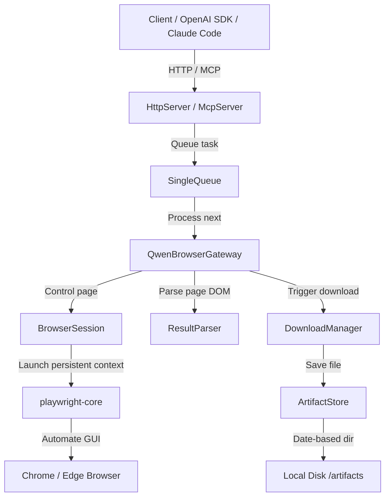

# Architecture

This document describes the internal structure, modules, and component interactions of **Qwen Chat Gateway**.

## Core Components

### 1. CLI (cac)
- Entry point for users to launch the HTTP server, open a visible browser, scan latest downloads, or start the MCP server.
- Verifies system requirements and environment overrides on startup.

### 2. HTTP Server (`node:http`)
- Lightweight, framework-free API server conforming to OpenAI compatible schemas.
- Exposes:
  - `/health`: Health status.
  - `/v1/models`: Returns supported models (`qwen-web`, `qwen-web-image`, `qwen-web-video`).
  - `/v1/chat/completions`: Wraps the visible browser session to return chat generation.
  - `/v1/images/generations`: Captures and returns generated image paths / URLs.
  - `/v1/videos/generations`: Captures and returns generated video paths / job status.
  - `/artifacts/*`: Safely streams static files with path-traversal countermeasures.

### 3. MCP Server (`@modelcontextprotocol/sdk`)
- Exposes specific tools to Claude Code (or other MCP hosts):
  - `qwen_chat`
  - `qwen_chat_with_file`
  - `qwen_generate_image`
  - `qwen_generate_video`
  - `qwen_import_latest_image`
  - `qwen_import_latest_video`
  - `qwen_browser_doctor`
- Communication happens strictly over standard input/output (stdio) transport.

### 4. SingleQueue & MinIntervalManager
- Establishes a FIFO (First-In, First-Out) promise chain limiting execution concurrency strictly to **1**.
- Ensures that a minimum of `QWEN_MIN_INTERVAL_MS` (default: 60,000ms) is enforced between consecutive browser inputs to avoid account throttling or detection.

### 5. BrowserSession (`playwright-core`)
- Launches your *existing* Chrome/Edge browser installation. Does not download bundled Chromium.
- Uses a persistent user profile context, enabling manual logging in *once* in visible mode.
- Does not contain automated login routines.

### 6. QwenBrowserGateway
- Interacts with the active page.
- Resolves DOM elements using a layered selector lookup strategy (Environment overrides -> accessibility roles -> text placeholders -> CSS selectors).
- Automatically triggers downloads and uploads.

### 7. ArtifactStore & DownloadManager
- Handles saving assets (Images, Videos) with date-segmented folder partitioning (`/artifacts/images/YYYY-MM-DD/`).
- Downloads are read directly as a memory stream and stored. Temporary files left behind by the browser are immediately cleaned up.
